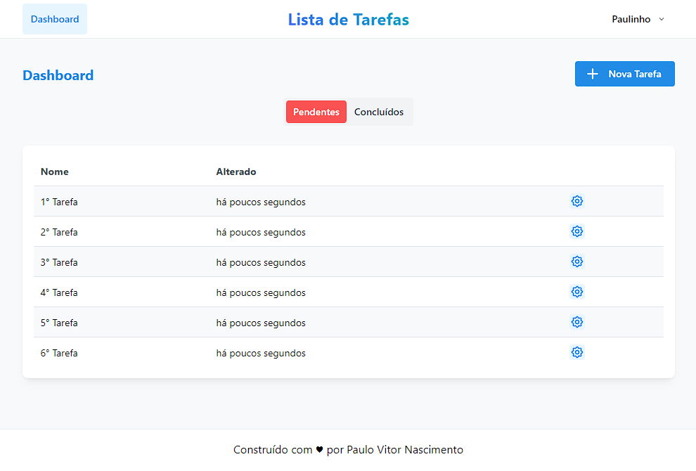

# Lista de tarefas com Laravel e Vite
[](https://laravel.com/) [](https://vitejs.dev/config/) [](https://pt-br.reactjs.org/) [](https://inertiajs.com/) [](https://mantine.dev/)

Uma lista de tarefas com acesso restrito com autenticação!

**[CLIQUE AQUI](https://todophp.foxtag.com.br/)** para testar (by Vercel)!

 <p align="center">
  <a src="#" target="_blank"></a>
</p>


## ❓ Intuito do projeto
Afim de manter o portfólio atualizado, criei essa lista de tarefas para treinar algumas skills também. Utilizando Laravel para o Backend e o React com Typescript através do Vite, recebendo dados pelo InertiaJS.

## ⛔️ Em breve

+ Perfil do usuário
+ Envio de emails (redefinição de senhas e confirmação de email)

## ⚠️ Aviso
Caso deseje testar em seu próprio ambiente, e que tudo funcione corretamente, você precisa ter o **Composer** mais recente, **PHP 8** e o **NodeJS v16** instalado.

## 🚀 Vamos começar?
Caso deseje testar esse projeto, siga os passos abaixo!

**Frontend**

+ Primeiro clone este repositório 
    ```jsx
    git clone https://github.com/linhous/laravel-vite-react-typescript.git
    ```
+ Entre na pasta laravel-vite-react-typescript
    ```jsx
    cd laravel-vite-react-typescript
    ```
+ Execute yarn para instalar as dependências 
    ```jsx
    yarn
    ```
**Backend**

+ Utilize o arquivo .env-example para criar um arquivo .env (pode-se copiar o arquivo examplo mantendo apenas o nome .env), aproveite para configurar o banco de dados.

+ Atualize os pacotes através do composer
    ```php
    composer install
    ```

+ Após a instalação, execute o comando para gerar a chave do Laravel
    ```php
    php artisan key:generate
    ```

+ Aproveite para popular o banco de dados com a estrutura atual
    ```php
    php artisan migrate
    ```

+ **Finalizando**
  Agora você só precisa iniciar os dois serviços:
    ```php
    php artisan serve
    ```
    ```jsx
    yarn dev
    ```
    Feito isso, você pode acessar a rota /register para se registrar e aproveitar a estrutura.

    **Dica**
    Você pode usar o comando:
    ```php
    php artisan route:list
    ```
    Veja as rotas disponíveis no projeto.